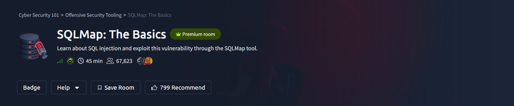
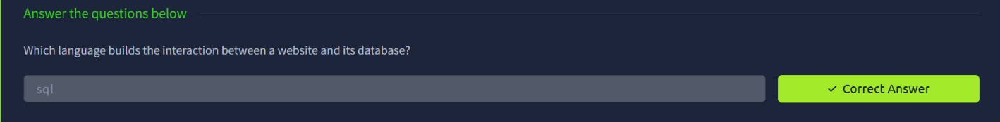
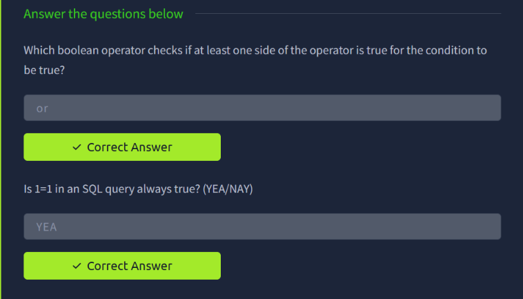
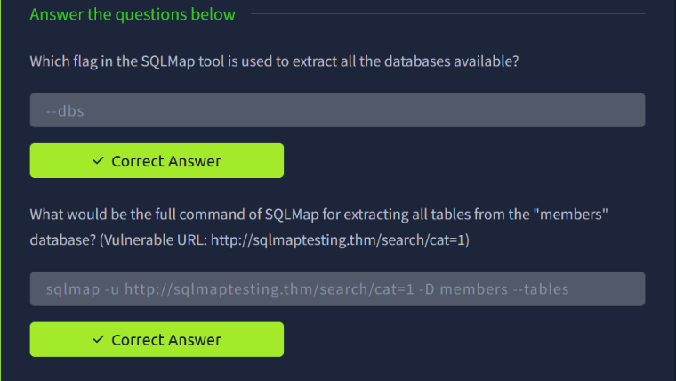
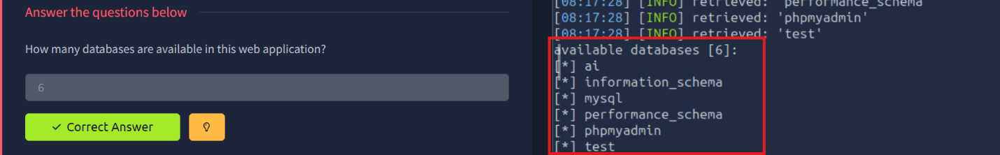
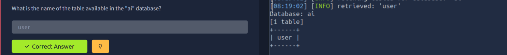
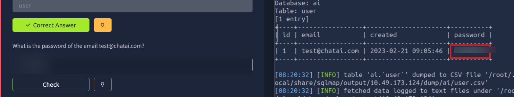

# TryHackMe — SQLMap: The Basics

> **Track:** Cyber Security 101 → Offensive Security Tooling
> **Difficulty:** Easy · **Time:** ~45 min
> **Focus:** SQL injection fundamentals and automating exploitation with SQLMap



SQLMap automates what manual SQL injection does by hand: detecting injectable parameters, enumerating the database structure, and extracting data. This room covers the underlying SQL injection logic first, then walks through using SQLMap against a live vulnerable target to go from "is this injectable?" all the way to a dumped credential.

---

## Table of Contents
1. [SQL and the Web](#1-sql-and-the-web)
2. [Boolean Logic Behind Injection](#2-boolean-logic-behind-injection)
3. [Core SQLMap Flags and Syntax](#3-core-sqlmap-flags-and-syntax)
4. [Enumerating Databases](#4-enumerating-databases)
5. [Enumerating Tables](#5-enumerating-tables)
6. [Dumping Data](#6-dumping-data)
7. [Key Takeaways](#7-key-takeaways)

---

## 1. SQL and the Web

**SQL** is the language that builds the interaction between a website and its database — every login form, search box, or product lookup that touches a database ultimately resolves to a SQL query behind the scenes. That query is exactly what SQL injection targets.



---

## 2. Boolean Logic Behind Injection

SQL injection payloads lean heavily on boolean logic to manipulate a query's `WHERE` clause:

- The **`OR`** operator checks if *at least one side* of the condition is true for the whole condition to be true — which is exactly why `OR 1=1` is the classic injection payload: it makes the condition true regardless of the legitimate check beside it.
- **`1=1` is always true** in a SQL query — a tautology that, when injected into a `WHERE` clause via `OR`, can bypass authentication checks or return every row in a table.



---

## 3. Core SQLMap Flags and Syntax

Two fundamentals for working with SQLMap:

- **`--dbs`** is the flag used to extract (enumerate) all databases available to the current connection.
- Building a full command for extracting tables from a known database follows this pattern:

```bash
sqlmap -u http://sqlmaptesting.thm/search/cat=1 -D members --tables
```

Here `-u` sets the target URL (with the injectable parameter), `-D` selects the target database, and `--tables` requests the table list for that database.



---

## 4. Enumerating Databases

Running SQLMap's database enumeration against the target confirms the injection point and returns every accessible database:

```bash
sqlmap -u <target-url> --dbs
```

The scan reports **6 available databases**: `ai`, `information_schema`, `mysql`, `performance_schema`, `phpmyadmin`, and `test`. Of these, `ai` stands out as the application-specific one worth digging into — the rest are standard MySQL system schemas.



---

## 5. Enumerating Tables

Targeting the `ai` database specifically:

```bash
sqlmap -u <target-url> -D ai --tables
```

The `ai` database contains a single table: **`user`** — immediately the most interesting target, since a table named `user` is almost always where credentials live.



---

## 6. Dumping Data

With the table identified, SQLMap dumps its contents:

```bash
sqlmap -u <target-url> -D ai -T user --dump
```

The dump returns a single entry: an account with the email `test@chatai.com`, a creation timestamp, and a password value. SQLMap also logs the dumped data to a CSV file automatically (`/root/.local/share/sqlmap/output/<target>/dump/ai/user.csv`) for later reference.



> Password redacted — the technique (identify database → identify table → dump) is what matters, not the literal credential.

---

## 7. Key Takeaways

- **`OR 1=1`-style tautologies** are the conceptual core of classic SQL injection — manipulating a `WHERE` clause to always evaluate true.
- **SQLMap mirrors a manual enumeration workflow**: `--dbs` → `-D <db> --tables` → `-D <db> -T <table> --dump`, just automated and far faster.
- **A table named `user` (or similar) is always worth prioritising** — it's the highest-value target in almost any database dump.
- **SQLMap logs everything it extracts to disk automatically**, which is convenient for later reporting but also means dumped data lingers on the attacking machine — worth remembering for cleanup after an authorized engagement.
- The same defenses that stop manual SQL injection (parameterized queries, input validation, least-privilege DB accounts) stop SQLMap just as effectively — the tool doesn't exploit anything a secure query wouldn't already prevent.

---

*Room completed on 4 October 2026 as part of the Cyber Security 101 path.*
